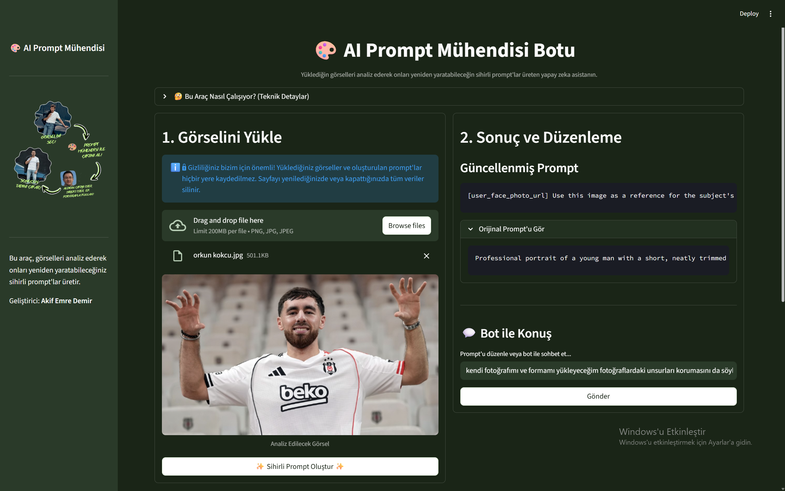

# 🎨 AI Prompt Mühendisi Botu

Bu proje,10millon.Ai,Global Ai Hub ve Akbank destekleriyle gerçekleştirilen  Bootcamp: Yeni Nesil Proje Kampı kapsamında geliştirilmiş, RAG (Retrieval Augmented Generation) temelli bir chatbottur. Uygulama, bir görseli analiz ederek onu yapay zeka sanat modellerinde (Midjourney, DALL-E, Nano Banana vb.) yeniden oluşturmak için kullanılabilecek detaylı metin istemleri (prompt) üreten interaktif bir web arayüzüne sahiptir.


---

## 🚀 Projenin Amacı

Sosyal medyada, reklamlarda veya dijital sanatta hepimiz hayranlık uyandıran görsellerle karşılaşıyoruz: Bazen profesyonel bir fotoğrafçının elinden çıkmış mükemmel bir çekim, bazen de yapay zekanın sınırlarını zorlayan müthiş bir dijital eser... Peki, bu görselleri biz nasıl oluşturabiliriz? Gerekli pahalı ekipmana veya o etkileyici sonucu verecek doğru "sihirli kelimelere" (prompt'lara) sahip olmadığımızda ne yapabiliriz?

İşte **AI Prompt Mühendisi Botu** tam da bu noktada devreye giriyor. Bu aracın amacı, gördüğünüz **herhangi bir görseli** analiz ederek, onu yeniden yaratmak için gereken detaylı teknik ve sanatsal tarifi size sunmaktır. Pahalı ekipmanlara veya karmaşık prompt bilgisine ihtiyaç duymadan, sadece ilham aldığınız görseli yükleyerek, onu nasıl oluşturabileceğinize dair profesyonel bir yol haritası (prompt) elde etmenizi sağlar.

Kısacası, bu proje, görsel yaratıcılığın önündeki engelleri kaldırmayı ve herkesin kendi "müthiş görselini" yaratabilmesi için bir köprü olmayı hedefler. Sadece bir araç değil, aynı zamanda kullanıcıyla diyalog kurarak o ilk fikri daha da geliştiren interaktif bir AI asistanıdır.

### ✨ Öne Çikan Özellikler

* **Görselden Prompt Üretme:** Yüklenen herhangi bir görseli analiz eder ve detaylı bir prompt oluşturur.
* **İnteraktif Sohbet Arayüzü:** Oluşturulan prompt'u "daha detaylı yap" veya "anime tarzına çevir" gibi komutlarla anında düzenleme imkanı sunar.
* **Dinamik Galeri:** Oturum boyunca oluşturulan tüm görselleri ve prompt'ları bir galeride sergiler (tarayıcı kapatılınca sıfırlar. Bu sayede kullanıcı gizliliği korunur.)
* **Akıllı Niyet Tespiti:** Kullanıcının bir komut mu yoksa bir sohbet cümlesi mi girdiğini anlayarak buna göre cevap verir.
* **Özelleştirilmiş Tasarım:** Kullanıcı deneyimini geliştirmek için özel renk paleti ve CSS stilleri kullanılmıştır.

---

## 📚 Veri Seti Hazırlama

Bu projede geleneksel, statik bir veri seti kullanılmamaktadır. Projenin veri kaynağı, kullanıcı tarafından **anlık olarak yüklenen görselin kendisidir**. Bu yaklaşım, her bir kullanıcı etkileşimini benzersiz ve dinamik bir veri işleme süreci haline getirir.

**Verinin Alınması ve İşlenmesi:**

1.  Kullanıcı, Streamlit arayüzündeki dosya yükleyici (`st.file_uploader`) aracılığıyla bir görsel dosyası (`.png`, `.jpg`, `.jpeg`) seçer.
2.  Bu görsel, Pillow kütüphanesi kullanılarak bir `Image` nesnesine dönüştürülür.
3.  Görsel verisi, Google Gemini modeline gönderilerek analiz edilir ve modelden prompt metni üretilmesi istenir.

**Gizlilik ve Temizlik:**
Kullanıcı tarafından yüklenen görseller veya üretilen prompt'lar **hiçbir şekilde sunucuda veya herhangi bir yerde kalıcı olarak saklanmaz**. Tüm veriler, kullanıcının o anki tarayıcı oturumu (`st.session_state`) ile sınırlıdır ve sayfa yenilendiğinde veya kapatıldığında tamamen silinir. Bu sayede kullanıcı gizliliği en üst düzeyde korunmaktadır.

---

## 🛠️ Kullanılan Yöntemler ve Çözüm Mimarisi 

Proje, bootcamp istemlerinde belirtilen RAG (Retrieval-Augmented Generation) temelli bir chatbot mimarisi üzerine kurulmuştur[cite: 2, 23]. Proje, klasik RAG adımlarını modern ve multimodal bir yaklaşımla yorumlar:

1.  **Retrieval (Bilgiyi Çekme):** Sistem, bilgiyi statik bir metin veritabanından çekmek yerine, kullanıcı tarafından o an yüklenen **görselin kendisinden** dinamik olarak çeker. Model, görseldeki pikselleri, renkleri, kompozisyonu ve stili analiz ederek "bilgi kaynağını" oluşturur.

2.  **Augmented (Desteklenmiş):** Görselden çekilen bu zengin bilgi, üretim adımını yönlendirmek ve desteklemek için kullanılır.

3.  **Generation (Üretim):** Google'ın **Gemini 2.5 Flash** modeli, görselden gelen bu destekleyici bilgiyle güçlendirilerek, son derece detaylı ve hedefe yönelik bir metin istemi (prompt) üretir.

Bu yapı, projenin sadece metinle değil, aynı zamanda görsel verilerle de çalışabilen, modern ve esnek bir RAG sistemi olmasını sağlar.

* **Web Arayüzü:** Kullanıcı dostu ve interaktif arayüz için **Streamlit** kullanılmıştır.
* **Generation Model:** Google Gemini 2.5 Flash (Multimodal yetenekli).
* **Prompt Mühendisliği:** Modelin davranışını yönlendirmek için 4 farklı sistem promptu kullanılmıştır.
* **Görsel İşleme:** **Pillow** kütüphanesi.
* **Ek Kütüphaneler:** `python-dotenv` (API anahtarı yönetimi), `requests` (Lottie animasyonu için), `streamlit-lottie` (Animasyon gösterimi).

---

## ✅ Elde Edilen Sonuçlar

Proje sonucunda, kullanıcı tarafından sağlanan herhangi bir görseli analiz edip, o görseli yeniden yaratmak için kullanılabilecek, teknik ve sanatsal detaylar içeren, profesyonel bir metin istemi (prompt) üreten bir web uygulaması başarıyla geliştirilmiştir[cite: 12]. [cite_start]Uygulama, kullanıcının bu prompt üzerinde değişiklik yapmasına ve bot ile sohbet etmesine olanak tanıyarak interaktif bir deneyim sunmaktadır[cite: 12]. Ayrıca, özel tasarım ve gizlilik notları ile kullanıcı deneyimi iyileştirilmiştir.

---

## 🔧 Kodun Çalışma Kılavuzu

Bu projeyi kendi bilgisayarınızda çalıştırmak için aşağıdaki adımları izleyin:

1.  **Projeyi Klonlayın**

    Projeyi GitHub'dan bilgisayarınıza indirin ve proje klasörüne gidin:
    ```bash
    git clone [https://github.com/](https://github.com/)demirakifemre/prompt_muhendisi_bot.git
    cd prompt_muhendisi_bot
    ```

2.  **Sanal Ortam Oluşturun ve Aktif Edin**

    Projenin bağımlılıklarını yönetmek için bir sanal ortam oluşturun ve aktif hale getirin:
    ```bash
    # Windows
    python -m venv venv
    .\venv\Scripts\activate
    ```
    *(Mac/Linux kullanıyorsanız `source venv/bin/activate` komutunu kullanın.)*

3.  **Gerekli Kütüphaneleri Yükleyin**

    Projenin ihtiyaç duyduğu tüm kütüphaneleri `requirements.txt` dosyasından yükleyin:
    ```bash
    pip install -r requirements.txt
    ```

4.  **API Anahtarınızı Ekleyin**

    Proje ana dizininde `.env` adında bir dosya oluşturun. İçine Google AI Studio'dan aldığınız API anahtarınızı aşağıdaki formatta ekleyin:
    ```
    GOOGLE_API_KEY="AIzaSy..."
    ```
    *(Bu dosyanın `.gitignore` içinde olduğundan emin olun, API anahtarınızı asla GitHub'a yüklemeyin.)*

5.  **Uygulamayı Başlatın**

    Streamlit uygulamasını başlatın:
    ```bash
    streamlit run app.py
    ```
    Uygulama tarayıcınızda varsayılan olarak `http://localhost:8501` adresinde açılacaktır.

## 🌐 Web Arayüzü & Product Kılavuzu

* **Deploy Linki:** `[...Deploy linki...]`



Uygulama Kullanımı 

Görsel Yükleme: Sol taraftaki "Görselini Yükle" bölümünden bir görsel dosyası (.png, .jpg) seçin veya sürükleyip bırakın. Yüklenen görsellerin hiçbir yere kaydedilmediği bilgisi burada yer almaktadır.

Prompt Oluşturma: "Sihirli Prompt Oluştur" butonuna basarak yapay zekanın görseli analiz etmesini bekleyin.

Sonucu İnceleme: Sağ tarafta, görseliniz için üretilen detaylı prompt'u görebilirsiniz.

İnteraktif Düzenleme: "Bot ile Konuş" kutusuna "bunu anime tarzında yap" gibi komutlar yazarak prompt'u güncelleyin veya "teşekkürler" gibi sohbet cümleleri kurarak bot ile etkileşime geçin. Güncelleme sonrası orijinal prompt'u da görebilirsiniz.

Galeriyi Keşfetme: Sayfanın alt kısmında, o anki oturumunuzda oluşturduğunuz tüm çalışmaları ve prompt'ları (orijinal ve güncellenmiş halleriyle) görebilirsiniz. Bu galerinin geçici olduğu bilgisi de burada yer almaktadır.


(İsteğe Bağlı: Buraya uygulamanın kullanımını gösteren birkaç ekran görüntüsü veya kısa bir video linki ekleyebilirsin.) 

✍️ Geliştirici
Akif Emre Demir - https://github.com/demirakifemre